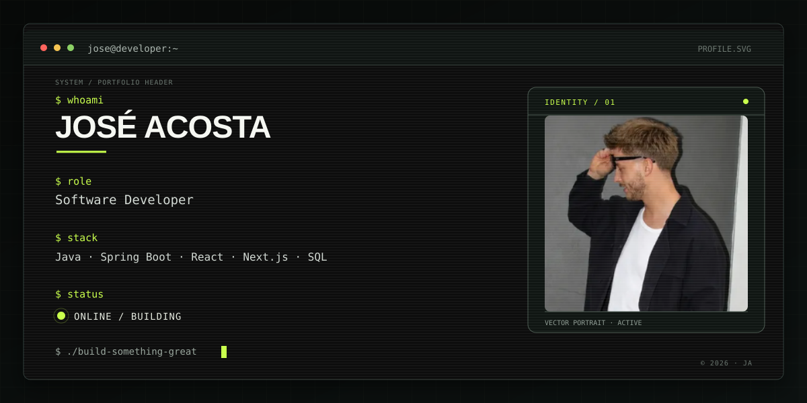

 

<!-- TYPING -->

 

<!-- SOCIALS -->

&nbsp;&nbsp;

&nbsp;&nbsp;

 

---

## This is me

Hi, I'm **José**, a Software Development student based in Spain.

I'm currently studying **Multiplatform Application Development (DAM)** and focusing on becoming a well-rounded software developer, with a particular interest in **Java, backend development and modern web technologies**.

I enjoy understanding how things work behind the scenes, but I also care about how software feels when people actually use it. I'm especially interested in the intersection between **code, design and interaction**.

- 🎓 **Multiplatform Application Development (DAM)** student
- ☕ Currently deepening my knowledge of **Java & Spring Boot**
- 🌐 Building interfaces and web experiences with **React & Next.js**
- 🧠 Always learning, experimenting and trying to understand the *why* behind the code
- 🛠️ Interested in backend development, APIs, databases and software architecture
- 🚀 Building personal projects to turn what I learn into real things

 

---

## My stack

 

 

---

## What I'm working on

I'm currently focusing on strengthening my foundations as a developer while moving deeper into **Java and backend development**.

### ☕ Backend

- Java
- Spring Boot
- REST APIs
- Object-Oriented Programming
- Databases & SQL
- Application architecture

### 🌐 Frontend

- JavaScript
- TypeScript
- React
- Next.js
- HTML & CSS
- Tailwind CSS

### 🛠️ Tools & workflow

- Git & GitHub
- IntelliJ IDEA
- VS Code
- Laragon
- MySQL / MariaDB
- Linux fundamentals

I'm also interested in **automation, system administration and understanding the infrastructure behind the applications I build**.

---

## Featured projects

### 🌐 Web 7

A web development project focused on building and structuring a complete website.

**Tech:** HTML · CSS · JavaScript

---

### 🍽️ Good Meals

A web project focused on creating a digital experience around food and meals.

**Tech:** HTML · CSS · JavaScript

---

### 🌴 BananaIsland

A project developed around a fictional island concept, combining web development, design and interactive elements.

**Tech:** Web development

---

## GitHub activity

---

## Let's connect

If you're interested in software development, technology, learning or building things, feel free to reach out.

 

  &nbsp;
  

 

Build with curiosity · José Acosta

